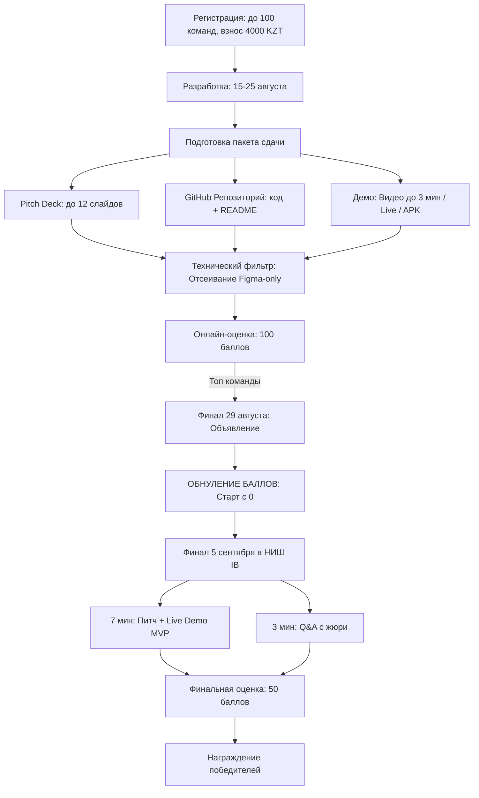

# Полный Регламент и Положение Хакатона «Future Minds Hackathon 2026»

> **Официальный документ:** ОФИЦИАЛЬНОЕ ПОЛОЖЕНИЕ О ПРОВЕДЕНИИ ХАКАТОНА «FUTURE MINDS HACKATHON 2026»  
> **Локация:** г. Астана, NIS IB (НИШ IB)  
> **Год проведения:** 2026  
> **Главный слоган:** *"AI for Good" — искусственный интеллект как инструмент позитивных изменений и устойчивого развития общества*

---

## 1. Общие положения и статус мероприятия

### 1.1. Статус и миссия
- **Future Minds Hackathon 2026** — соревновательно-образовательный хакатон, посвящённый разработке инновационных решений с применением искусственного интеллекта.
- **Площадка проведения:** База школы **NIS IB (Назарбаев Интеллектуальная школа Международного Бакалавриата)** в г. Астана.
- **Целевая аудитория:** Талантливые школьники и учащиеся, стремящиеся создавать технологии для решения актуальных задач в сферах образования, общества и экологии.
- **Цель:** Объединение молодых лидеров, новаторов и создателей для разработки инновационных AI-решений, способных внести реальный вклад в развитие образования, решение общественных вызовов и улучшение экологической ситуации.

### 1.2. Организационный комитет (Future Minds Hub)
Организатором выступает команда **Future Minds Hub** — объединение учеников 9–10 классов NIS IB Astana:
- **Мурат Инкар** — основатель команды FM Hub
- **Бровко Радмир** — руководитель медиа и дизайна
- **Абикаев Сабырали** — технический координатор
- **Абдикарим Сабина** — руководитель финансов
- **Абдрахманова Алима** — координатор площадки

### 1.3. Языковой регламент
- **Язык хакатона:** Исключительно **русский язык**.
- Все материалы (конкурсная документация, питч-деки, видеопрезентации, защита проектов) принимаются и проводятся строго на русском языке.

---

## 2. Участники и требования к командам

### 2.1. Возрастной ценз и категории
- Обучающиеся **7–12 классов** общеобразовательных организаций.
- Иные лица в возрасте **от 13 до 20 лет включительно**.

### 2.2. Состав и формат команд
- **Размер команды:** от 2 до 4 человек.
- **Индивидуальное участие:** Официально **допускается** (команда из 1 человека).
- **Квота участников:** Максимальное общее количество команд — **100**. При достижении лимита регистрация закрывается автоматически.

### 2.3. Правила участия и регистрация
- Каждый участник имеет право состоять **только в одной команде**.
- **Кросс-участие** (одновременное участие в нескольких командах) категорически **запрещено** и влечет **немедленную дисквалификацию** всех связанных команд/участников.
- **Замена участников:** Допускается не позднее чем за **48 часов до дедлайна онлайн-этапа** строго при согласовании с Оргкомитетом.

### 2.4. Регламент участия в финале
- **Очные команды:** Обязательно физическое присутствие минимум **1 участника** на площадке НИШ IB в г. Астана.
- **Региональные команды:** Предусмотрен **онлайн / гибридный формат** участия при наличии предварительного согласования с Оргкомитетом.

---

## 3. Финансовые условия, логистика и официальные письма

### 3.1. Организационный взнос
- **Стоимость:** **4 000 тенге с команды** (фиксированная сумма, не зависит от количества участников в команде — будь то 1 или 4 человека).
- **Условия возврата:** Взнос является **невозвратным** после успешного прохождения первичного технического фильтра.

### 3.2. Логистика
- Оргкомитет **не покрывает** расходы участников на проезд, проживание и суточные. Очные участники организуют и оплачивают логистику самостоятельно.

### 3.3. Содействие и освобождение от занятий
- По официальному запросу команды Оргкомитет высылает **именное пригласительное/ходатайственное письмо** на имя руководителя учебного заведения (директора/ректора) для содействия в официальном освобождении участников от занятий на период финала.

---

## 4. Сроки и ключевые этапы хакатона

Хакатон проходит в **2 этапа**: **Онлайн-отбор** $\rightarrow$ **Очный / гибридный финал в НИШ IB г. Астана**.

| Дата | Этап | Подробное описание |
| :--- | :--- | :--- |
| **15 августа** | **Публикация кейсов / Старт** | Кейсы тематических направлений публикуются на платформе. Официальный старт разработки. |
| **25 августа** | **Дедлайн онлайн-этапа** | Дедлайн загрузки всех проектных материалов на платформу. Работы, отправленные позже дедлайна, к оценке **не допускаются**. |
| **29 августа** | **Объявление финалистов** | Экспертная комиссия завершает проверку, публикуется официальный список команд, допущенных к очному/гибридному финалу. |
| **5 сентября** | **Финал в НИШ IB г. Астана** | Очная защита проектов перед жюри: питч + живая демонстрация работающего MVP + Q&A сессия. |

> ⚠️ *Оргкомитет оставляет за собой право скорректировать сроки с заблаговременным уведомлением участников.*

---

## 5. Тематические направления (Треки)

Команды выбирают одно из двух направлений на этапе регистрации.

### Трек 1: EcoFin
*AI-проекты, объединяющие экологические и финансовые решения (GreenTech, FinTech, ESG, устойчивое финансирование).*
- **Проблемные зоны:**
  1. Оптимизация использования природных ресурсов;
  2. Сокращение объёма отходов и развитие технологий переработки;
  3. Повышение энергоэффективности;
  4. Мониторинг и снижение загрязнения окружающей среды;
  5. Борьба с изменением климата;
  6. Развитие экономики замкнутого цикла (Circular Economy);
  7. Сохранение биоразнообразия;
  8. Формирование устойчивых и экологичных моделей потребления.

### Трек 2: Social Impact
*Инновационные AI-решения, направленные на решение острых социальных проблем, равенство и повышение качества жизни.*
- **Проблемные зоны:**
  1. Улучшение доступности социальных услуг;
  2. Поддержка инклюзии и обеспечение равных возможностей;
  3. Повышение общественной безопасности;
  4. Развитие цифровой грамотности населения;
  5. Повышение качества и доступности образования (EdTech);
  6. Поддержка здоровья и благополучия граждан (Health & Well-being);
  7. Развитие гражданской активности, комьюнити и волонтёрства;
  8. Повышение доступности и прозрачности государственных и общественных сервисов (GovTech / CivicTech).

> ⚠️ **Правило переноса трека:** Если в процессе разработки проект объективно смещается в логику другого трека, Оргкомитет вправе принудительно перевести команду в более подходящее направление для обеспечения честной и справедливой конкуренции.

---

## 6. Требования к сдаче проекта (Онлайн-отбор)

До дедлайна онлайн-этапа (25 августа) команда обязана сдать полный пакет материалов из **3 обязательных компонентов**:

```
[ПАКЕТ СДАЧИ ОНЛАЙН-ЭТАПА]
 ├── 1. Pitch Deck (PDF, строго до 12 слайдов)
 ├── 2. Публичный репозиторий кода (GitHub / GitLab с README.md)
 └── 3. Подтверждение работоспособности MVP (Видео-демо ИЛИ Live-ссылка / APK)
```

### 6.1. Pitch Deck (Презентация)
- **Формат:** PDF.
- **Ограничение:** Не более **12 слайдов**.
- **Обязательная каноническая структура:**
  1. **Проблема** (актуальность, масштабы, боли целевой аудитории);
  2. **Решение** (концепция продукта, ценностное предложение);
  3. **Целевая аудитория** (сегментация, портрет пользователя);
  4. **Технологический стек** (архитектура, используемые AI-модели, сервисы);
  5. **Бизнес-модель** (монетизация, unit-экономика или модель социального импакта/масштабирования);
  6. **Команда** (роли, компетенции участников).

### 6.2. Исходный код и репозиторий
- **Платформа:** Публичный репозиторий на **GitHub** или **GitLab**.
- **Обязательный файл `README.md`**, содержащий:
  - Описание стека технологий;
  - Архитектуру проекта и схему взаимодействия компонентов (включая AI пайплайн);
  - Пошаговую инструкцию по локальному развертыванию и запуску проекта.

### 6.3. Подтверждение работоспособности MVP (на выбор команды)
Команда должна предоставить один из вариантов:
- **Вариант А:** Видео-демо / скринкаст работы интерфейса и AI-функционала длительностью **до 3 минут** (ссылка на YouTube или открытый Google Диск).
- **Вариант Б:** Прямая Live-ссылка на развёрнутый веб-сервис (деплой) или готовый скомпилированный APK-файл для мобильных приложений.

### 🚨 Жёсткое правило технического фильтра:
> **Проекты, содержащие ТОЛЬКО дизайн-макеты (например, ссылки на Figma, скриншоты дизайна) без работающего программного кода и функционирующего бэкенда/фронтенда, АВТОМАТИЧЕСКИ ОТСЕИВАЮТСЯ на первичном техническом фильтре без права апелляции.**

---

## 7. Полная система и критерии оценивания

### 7.1. Онлайн-этап (Максимум: 100 баллов)
Баллы выставляются экспертной комиссией по 6 критериям. Онлайн-этап является **квалификационным ситом**.

| № | Критерий оценки | Макс. балл | Подробное пояснение жюри |
| :-: | :--- | :-: | :--- |
| 1 | **Инновационность идеи** | **25** | Оригинальность, новизна подхода и нестандартность предложенного решения проблемы. Отсутствие банальных клонов. |
| 2 | **Актуальность проблемы** | **20** | Насколько выявленная проблема реальна, подтверждена фактами/исследованиями и значима для выбранного трека. |
| 3 | **Использование ИИ** | **20** | Глубина, техническая обоснованность и целесообразность применения технологий искусственного интеллекта в проекте (не "AI ради AI"). |
| 4 | **Реализуемость решения** | **15** | Техническая и ресурсная выполнимость предложенного продукта в реальных условиях. |
| 5 | **Качество прототипа (MVP)** | **10** | Работоспособность, удобство интерфейса, отсутствие критических ошибок, полнота реализации заявленного функционала. |
| 6 | **Презентация проекта** | **10** | Ясность, логическая стройность, визуальная аккуратность, структурированность и убедительность материалов Pitch Deck. |
| | **ИТОГО ОНЛАЙН-ЭТАП** | **100** | **Максимальный квалификационный балл** |

---

### 7.2. Финал (Очный / Гибридный) (Максимум: 50 баллов)

#### Регламент выступления на финале:
- **7 минут:** Питч проекта + **живая демонстрация работающего MVP (Live Demo)**.
- **3 минуты:** Сессия вопросов и ответов (**Q&A**) с членами экспертного жюри.

#### Критерии оценивания финала:

| № | Критерий | Макс. балл | Описание и требования |
| :-: | :--- | :-: | :--- |
| 1 | **Живая демонстрация MVP** | **10** | Стабильность работы продукта в реальном времени, отсутствие сбоев/критических багов, успешное прохождение ключевого пользовательского сценария. |
| 2 | **Техническая защита (Q&A)** | **10** | Глубокое понимание кода, архитектуры решения, способность каждого участника аргументированно объяснить любой фрагмент логики и AI-модели. |
| 3 | **UI/UX и дизайн** | **10** | Удобство интерфейса, продуманность путей пользователя (User Journey), intuitive navigation, визуальная эстетика и адаптивность. |
| 4 | **Масштабируемость / Монетизация** | **10** | Проработанность бизнес-модели, расчет объема рынка (TAM / SAM / SOM), социальный эффект, долгосрочная жизнеспособность продукта. |
| 5 | **Питч и подача команды** | **10** | Качество и харизма презентации, командная синергия, слаженность, уверенность и аргументированность ответов на каверзные вопросы жюри. |
| | **ИТОГО ФИНАЛ** | **50** | **Максимальный финальный балл** |

> ⚠️ **ПРАВИЛО ОБНУЛЕНИЯ БАЛЛОВ (Zero-Reset Rule):**  
> Баллы онлайн-этапа **не переносятся** в финал и не суммируются с финальными оценками. В финале все прошедшие команды **стартуют с нуля (0 баллов)**. Победители определяются исключительно на основе 50 баллов финала.

---

## 8. Политика использования искусственного интеллекта (AI Policy)

Хакатон поощряет использование современных инструментов, но устанавливает жесткие рамки авторства:

### 8.1. Допустимый объём AI-генерации кода
- Разрешено использование AI-ассистентов разработки (Cursor, GitHub Copilot, ChatGPT, Claude, Gemini и др.).
- Допустимый объем сгенерированного кода составляет **не более 20% от общего объёма работы**.
- **Критическое требование:** Участники обязаны досконально и полностью понимать архитектуру, логику работы алгоритмов и каждую строчку кода своего продукта.

### 8.2. Санкции и контроль понимания кода
- Во время технической защиты (Q&A) жюри имеет право задать вопрос по любому участку кодовой базы.
- Если участник не может объяснить принцип работы фрагмента кода или логику работы модели — оценка по критерию **«Техническая защита» снижается вплоть до 0 баллов**.
- Умышленный плагиат, выдача чужого опенсорс-проекта за свой или использование готового стороннего решения, созданного до хакатона, влечет **немедленную дисквалификацию**.

---

## 9. Технический регламент, фреймворки и допустимые послабления

### 9.1. Технические послабления и выбор стека
- **Языки программирования и фреймворки:** Полная свобода выбора (Python, JavaScript/TypeScript, React, Vue, Flutter, React Native, FastAPI, Django, Go и др.).
- **No-Code / Low-Code:** По положению проект должен содержать **публичный репозиторий с исходным кодом** и работающий MVP. Использование конструкторов допускается только в связке с кастомным кодом, интеграциями и AI-пайплайнами, так как оценивается качество кода и архитектура в README.
- **Готовые AI API и модели:** Разрешено использование открытых и коммерческих API (OpenAI, Anthropic, Google Gemini, Hugging Face, локальные модели Ollama/vLLM, Whisper, LangChain, LlamaIndex), однако жюри оценивает *глубину и обоснованность применения ИИ*, а не простую обертку над одним промптом.

### 9.2. Что категорически запрещено:
1. Сдача чисто визуальных прототипов (Figma) без реализации в коде.
2. Проекты, начатые до официального старта хакатона (15 августа).
3. Полная генерация проекта нейросетью без участия и понимания разработчиков (>20% генерации без осмысления).

---

## 10. Интеллектуальная собственность

1. **Права участников:** Все исключительные авторские и имущественные права на разработанные продукты, программный код, базы данных, дизайн и алгоритмы **в полном объёме принадлежат участникам команды**.
2. **Права организаторов:** Оргкомитет получает неисключительное безвозмездное право использовать презентационные материалы, видео-демо, скриншоты и фотографии для некоммерческого освещения хакатона в СМИ и социальных сетях.
3. **Права партнеров:** Официальные компании-партнёры хакатона имеют приоритетное право предложить финалистам сотрудничество, менторство, гранты или запуск совместного пилотного проекта.

---

## 11. Основания для дисквалификации и регламент апелляций

### 11.1. Чек-лист причин немедленной дисквалификации:
- ❌ **Плагиат:** Присвоение чужого кода, сдача наработок, созданных до старта хакатона (15 августа), использование чужих готовых сервисов.
- ❌ **Нарушение дедлайна:** Загрузка или изменение материалов после официального дедлайна онлайн-этапа (25 августа).
- ❌ **Кросс-участие:** Нахождение одного участника в составах двух или более команд.
- ❌ **Неспособность пройти техническую защиту:** Невозможность объяснить исходный код на сессии Q&A.
- ❌ **Неэтичное поведение:** Проявление агрессии, неспортивного поведения, неуважения к другим участникам, волонтерам, Оргкомитету или членам жюри.

### 11.2. Регламент апелляций
- Все оценки экспертной комиссии на онлайн-этапе и оценки жюри в финале являются **окончательными**, протоколируются и **не подлежат обжалованию или пересмотру**.

---

## 12. Персональные данные и согласия

- При прохождении регистрации каждый участник автоматически дает согласие на сбор, хранение и обработку персональных данных, а также на проведение фото- и видеосъемки в рамках мероприятий хакатона.
- **Для несовершеннолетних финалистов:** Обязательно предоставление **письменного согласия родителей / законных представителей**. Официальный шаблон согласия рассылается Оргкомитетом 29 августа вместе с объявлением списка финалистов.

---

## 13. Официальные контакты Оргкомитета

- **Электронная почта:** `future.minds@gmail.com`
- **Официальный Instagram:** `@future.minds.hub`
- **Телефон / WhatsApp:** `+7 775 230 4350`
- **Локация финала:** г. Астана, ул. Хусейн бен Талал, школа NIS IB

---

## 14. Сводная матрица стратегии победы



### Ключевые фокусы для максимального балла:
1. **Онлайн-этап (100 баллов):** Наибольший вес имеют **Инновационность идеи (25)**, **Актуальность проблемы (20)** и **Использование ИИ (20)** — суммарно 65% оценки!
2. **Финал (50 баллов):** Все 5 критериев сбалансированы (по 10 баллов каждый). Главный риск — сессия Q&A (понимание 100% кода) и стабильность Live Demo (никаких багов во время живого показа).
